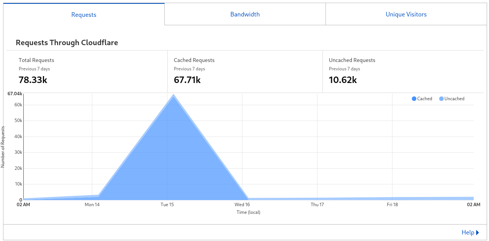
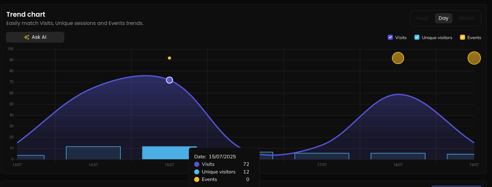

## 🔫 Mon besoin

J'ai récemment mis en ligne mon blog (https://blog.wheezy.fr) et j'ai commencé à voir pas mal de trafic qui me paraissait anormal. J'ai donc décidé de mettre en place un proxy qui pourrait aider à bloquer tout cela.
J'avais déjà entendu parler d'Anubis sans jamais l'avoir mis en place, je vais donc essayer de le faire maintenant.

---

## 🛡️ Fonctionnement de Anubis

Anubis est un **reverse proxy spécialisé dans la détection des bots**.
Il ne remplace pas Nginx ou Traefik, il se place simplement **en amont** de votre reverse proxy ou de votre application.

---

### 🔍 Comment ça marche ?
1. Anubis analyse les **headers HTTP** à chaque requête.
2. Si le **User-Agent** contient `Mozilla` et que le chemin n'est pas un fichier connu (`/favicon.ico`, `/robots.txt`) ou un flux RSS (`.rss`, `.xml`, `.atom`), il suspecte un navigateur ou un scraper.
3. Il présente alors un **challenge** (cookie, JavaScript, honeypot ou proof-of-work).
4. Si le client réussit, Anubis délivre un **cookie JWT signé** prouvant la réussite.
5. Ce cookie permet de **passer sans rechallenge pendant 1 semaine**.

---

## 🚀 Comment j'ai décidé de le déployer ?

Il y a plusieurs façons de le déployer, pour ma part j'ai choisi de le déployer en tant que sidecar dans mon pod. Vous pouvez retrouver les autres méthodes dans la [documentation officielle](https://anubis.techaro.lol/docs/category/environments).


flowchart LR
    T(Traffic utilisateur)
    IngressController(IngressController)
    subgraph Service
        AnPort(Anubis Port)
        BPort(Backend Port)
    end
    subgraph Pod
        An(Anubis)
        B(Backend)
    end
    T -->  IngressController
    IngressController --> AnPort
    AnPort --> An
    An --> B


---

#### 🔐 Secret pour la clé de signature JWT d'Anubis

kubectl create secret generic anubis-key \
  --namespace default \
  --from-literal=ED25519_PRIVATE_KEY_HEX=$(openssl rand -hex 32)


---

#### 🗃️ Déploiement Kubernetes simplifié pour Anubis

containers:
  - name: anubis
    image: ghcr.io/techarohq/anubis:latest
    imagePullPolicy: Always
    env:
      - name: "BIND"
        value: ":8080" # Port anubis
      - name: ED25519_PRIVATE_KEY_HEX
        valueFrom:
          secretKeyRef:
            name: anubis-key
            key: ED25519_PRIVATE_KEY_HEX # Secret pour les différents challenges
      - name: "TARGET"
        value: "http://localhost:5000" # Ici mettre le port du backend
    resources:
      limits:
        cpu: 750m
        memory: 256Mi
      requests:
        cpu: 250m
        memory: 256Mi
    securityContext:
      runAsUser: 1000
      runAsGroup: 1000
      runAsNonRoot: true
      allowPrivilegeEscalation: false
      capabilities:
        drop:
          - ALL
      seccompProfile:
        type: RuntimeDefault


---

#### 📡 Service Kubernetes pour exposer Anubis

spec:
  ports:
    - protocol: TCP
      port: 8080
      targetPort: 8080
      name: anubis


---

#### 🌍 Exemple d'Ingress pour rediriger le trafic vers Anubis

rules:
- host: mon-site.fr
  http:
    paths:
    - pathType: Prefix
      path: "/"
      backend:
        service:
          name: anubis
          port:
            name: anubis


---

## 🛠️ Customiser le déploiement

Anubis propose également la possibilité de customiser sa configuration, vous pouvez retrouver ça [ici](https://anubis.techaro.lol/docs/admin/policies).
J'ai trouvé la configuration un peu lourde.

Il est par exemple possible de supprimer le blocage d'Anubis pour les images, en ajoutant la configuration suivante dans `/data/bots/bots.yaml` (via un montage ConfigMap) :


bots:
- name: robots-txt
  path_regex: ^/robots.txt$
  action: ALLOW


Je trouve que ce fonctionnement n'est pas très intuitif, donc pour pallier ça, j'ai créé une ingress qui ne prend en compte que les requêtes vers `/.*\.(png|jpg|jpeg|gif|ico|svg|webp)$` :

---

# 📊 Conclusion

|  |  |
|:---------------------------:|:-----------------------:|
| À gauche, on peut voir qu'environ **70k connexions** ont été tentées le 15/07 depuis l'étranger, probablement des bots. | À droite, on remarque qu'au final seulement **72 visites** ont réellement eu lieu, ce qui prouve l'efficacité d'Anubis. |

Anubis est vraiment un outil très simple de protection contre les bots et les attaques de type DDoS.
Il est également très facile à configurer et à utiliser.
Cela évite de déployer des usines à gaz comme CrowdSec ou d'autres solutions similaires, mais plus lourdes.
