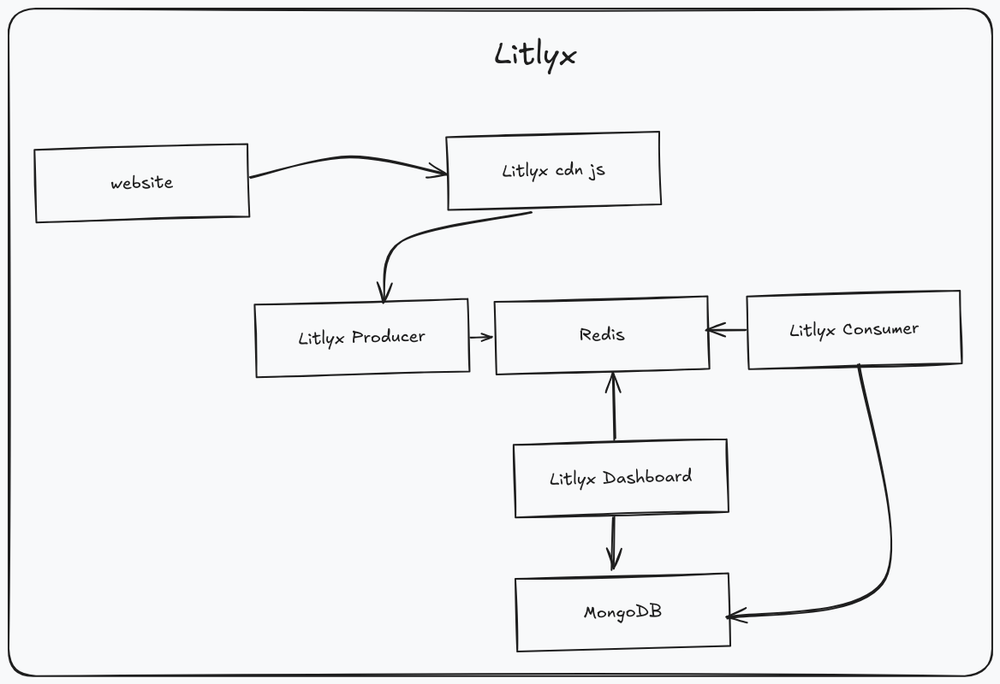
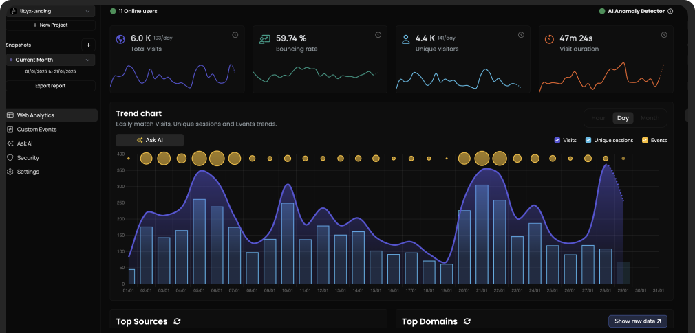

## Le problème avec les analytics traditionnels

Mon site web méritait un peu d'analyse de trafic. Classiquement, on installe Google Analytics, on colle le script, et voilà. Sauf que ces dernières années, les cookies tiers deviennent de plus en plus problématiques. Il faut afficher des banners, gérer le consentement, et au final dépendre d'un service externe qui collecte bien plus que ce dont j'ai besoin.

Matomo ? C'est l'alternative open source de référence, mais elle reste lourde et utilise encore des cookies. Pour un simple blog personnel, j'avais besoin de quelque chose de plus léger et respectueux de la vie privée.

## Découverte de Litlyx

En cherchant des alternatives, je suis tombé sur Litlyx. L'idée est simple : des analytics sans cookies, setup en 30 secondes, et possibilité de self-hosting. Litlyx est un outil d'analyse web moderne, sans cookies, qui se configure en moins de 30 secondes et est entièrement auto-hébergeable.

Ce qui m'a convaincu :
- **Pas de cookies** : Litlyx collecte des données anonymement sans utiliser de cookies
- **Open source** : code disponible sur GitHub
- **Léger** : juste une ligne de code à ajouter
- **Self-hostable** : parfait pour mon cluster Kubernetes



## Déploiement sur Kubernetes

Actuellement, j'ai un cluster Kubernetes à la maison pour mes projets perso. J'ai voulu donc déployer Litlyx dessus, mais aucune chart Helm existante pour faciliter le déploiement, j'ai donc créé la mienne que j'ai rendu publique sur GitHub




### Architecture

Litlyx est composé de plusieurs composants :




### Intégration simple

Je cherchais une intégration trés simple à mes projets web déja existant, pour l'ajouter rien de plus simple :
```html
<script defer data-project="<numéro du projet Litlyx>" src="https://cdn.jsdelivr.net/gh/litlyx/litlyx-js/browser/litlyx.js" data-host="<URL vers producer de Litlyx>"></script>
```

Et c'est tout. Pas de configuration complexe, pas de cookies, pas de banner de consentement.

## Résultats

Après quelques semaines d'utilisation, je récupère les métriques essentielles :
- Pages vues
- Visiteurs uniques
- Sources de trafic
- Géolocalisation approximative

Le tout dans un dashboard propre et responsive. Les insights alimentés par l'IA et le suivi de données en temps réel sont incroyablement conviviaux.

## Une Interface sympa

Litlyx propose une interface utilisateur intuitive et agréable à utiliser. Elle permet de visualiser rapidement les principales métriques et de comprendre facilement les tendances du trafic



## Possibilité de customization

Ce qui est sympa avec Litlyx, c'est qu'on peut aller plus loin que les métriques de base. L'API permet de tracker des events custom assez facilement.
Par exemple, pour suivre les téléchargements les clics sur des liens, il suffit d'ajouter quelques lignes de JavaScript :

```javascript
Lit.event('click_on_buy_item', {
  metadata: {
    'product-name': 'Coca-Cola',
    'price': 1.50,
    'currency': 'EUR'
  }
});
```

## Conclusion

Pour un site personnel où je veux juste comprendre le trafic sans déployer une usine a gaz, Litlyx coche toutes les cases. Le déploiement sur Kubernetes me donne la tranquillité d'esprit sur mes données, et l'absence de cookies évite tout le bordel légal

Si vous cherchez une alternative simple et respectueuse aux analytics traditionnels, Litlyx mérite le détour. Surtout si vous avez déjà un cluster k8s qui traîne.


**Warning!** Litlyx est toujours en développement et actuellement aucune version stable n'est disponible


---
