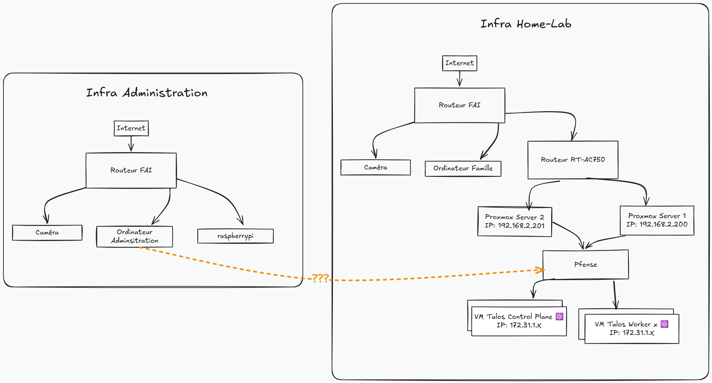
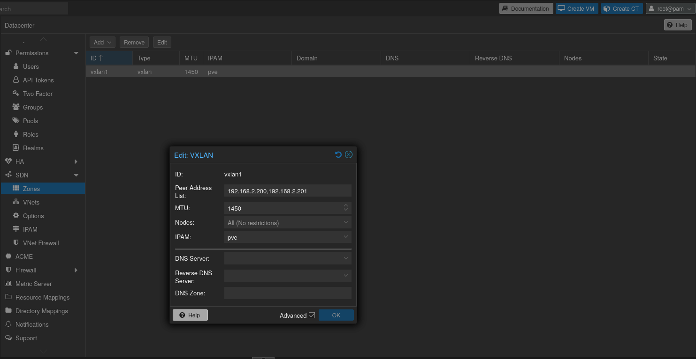
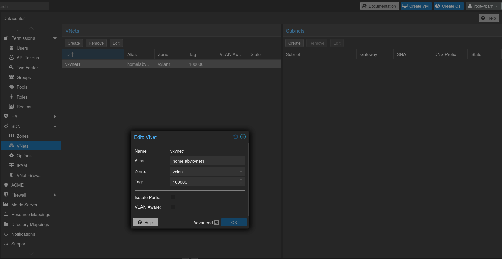
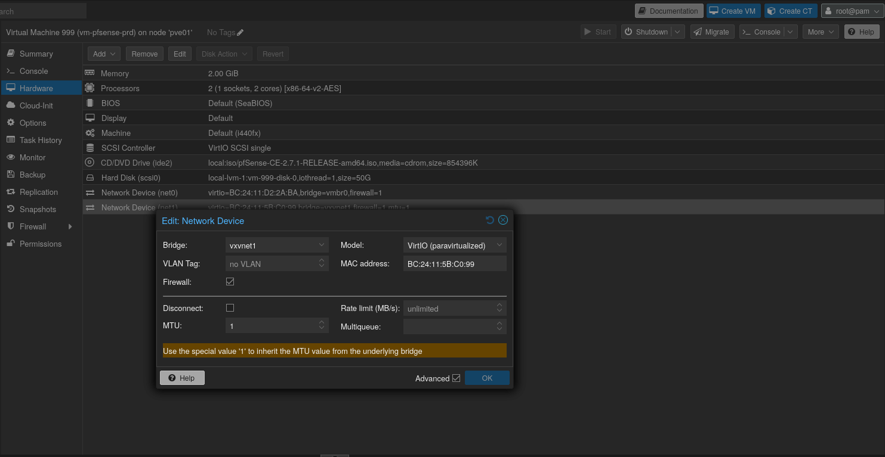
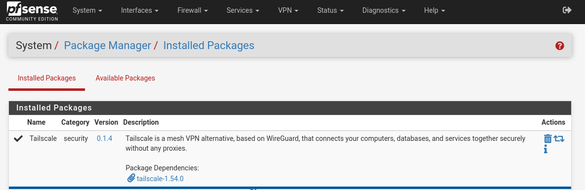
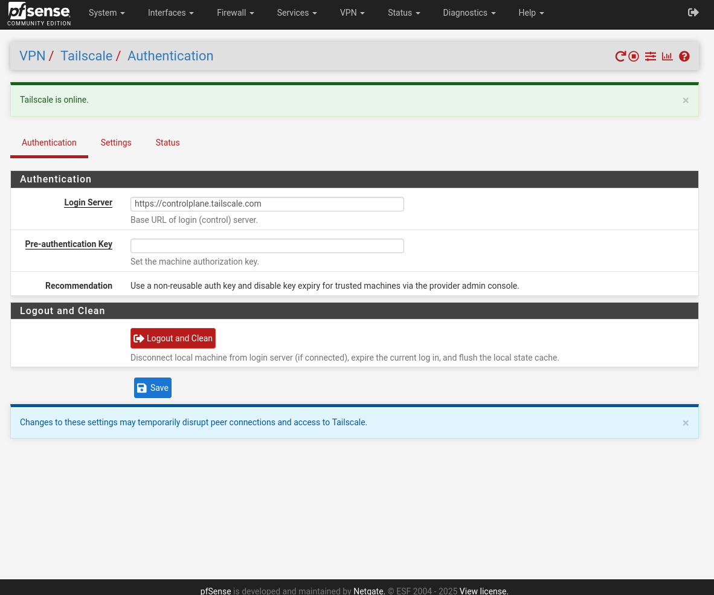
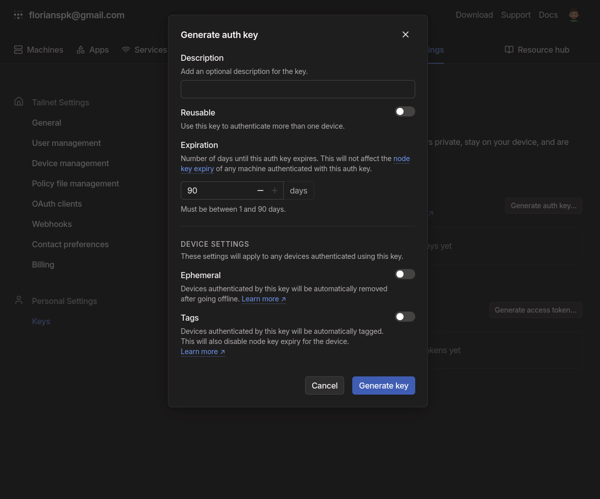
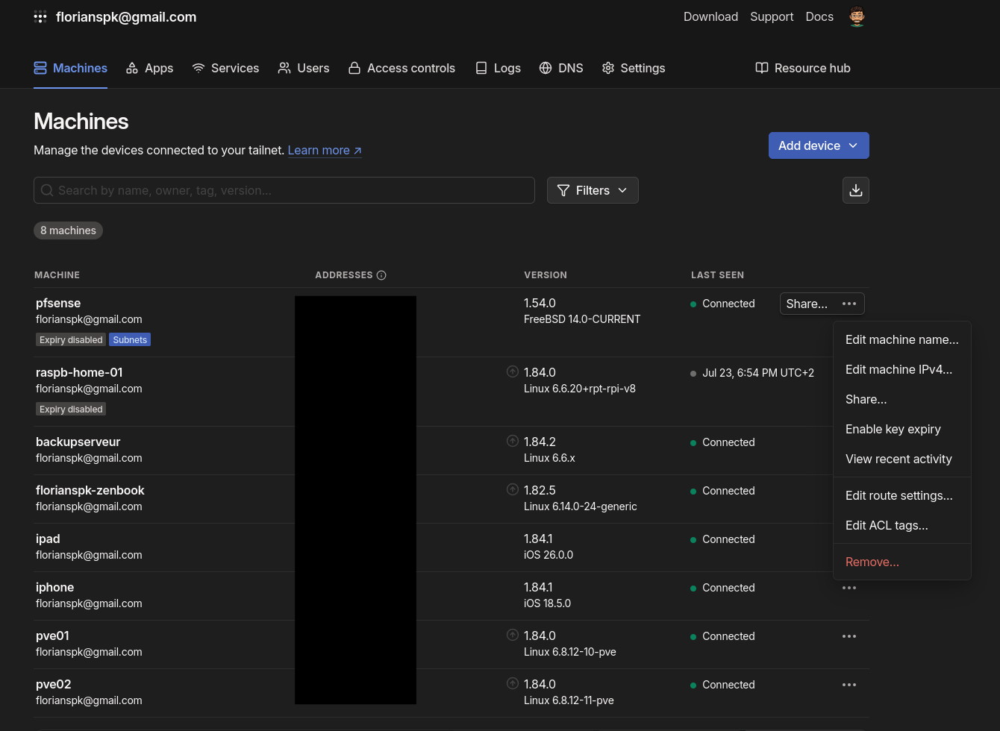
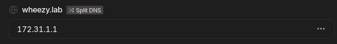

# Introduction

## 🔫 Mon besoin avec Tailscale

Actuellement, mon homelab est physiquement situé dans une autre ville, à quelques kilomètres de chez moi. Je devais donc demander une IP publique pour y accéder depuis l'extérieur via VPN — ce qui, avouons-le, n’est pas l’idéal.
Il y a plusieurs mois, on m’a parlé de **Tailscale**, une solution qui permet de créer un **réseau privé virtuel entre plusieurs machines**, sans avoir besoin d’IP publique.

Je vous mets [ce lien](https://tailscale.com/blog/how-nat-traversal-works) pour comprendre comment ça fonctionne sous le capot.

## 🔒 Pourquoi pfSense ?

J'ai déjà déployé **Tailscale** sur mes machines physiques afin d'accéder facilement à mon infrastructure homelab depuis chez moi, en toute sécurité.

Pour aller plus loin, je souhaite créer un **réseau privé virtuel entre mes hôtes Proxmox physiques**. L’objectif est de déployer toutes mes machines virtuelles dans ce réseau privé, pour une meilleure isolation et sécurité.

Pour cela, j'ai choisi **pfSense**, une solution :

- simple à mettre en place 🛠️
- très configurable ⚙️

Ce qui m’a séduit chez pfSense, c’est qu’il peut remplir plusieurs rôles essentiels dans mon architecture :

- 🔥 **Pare-feu** entre mon réseau privé virtuel et l’extérieur
- 🕰️ **Serveur NTP** pour synchroniser toutes mes machines
- 📛 **Serveur DNS interne** pour la résolution locale

Mon but : utiliser **pfSense avec Tailscale** pour créer un **réseau privé d’administration** accessible depuis l’extérieur, uniquement via Tailscale.

🎯 Résultat : aucun port ouvert, un accès sécurisé, et un contrôle total sur mon infrastructure.

---

## 🗺️ Schéma d’architecture envisagé

Voici comment j’imagine mon réseau :

---

# ⚙️ Mise en place du réseau privé virtuel avec pfSense + Tailscale sur Proxmox

## 🏗️ Configuration Proxmox

1. Je commence par déclarer une **zone SDN** sur Proxmox, ici j’opte pour une zone **VXLAN**.
   Il est important de bien déclarer les IP de ses hôtes Proxmox pour qu’ils communiquent entre eux.

   

2. Ensuite, je crée une **interface réseau virtuelle** sur Proxmox que je rattache à pfSense.

   

3. Je monte cette interface directement sur la VM pfSense.
   ⚠️ Attention : si vous avez modifié le MTU, pensez à le mettre à 1 ici.

   

---

## 🧱 Configuration pfSense

Pour la configuration initiale de pfSense, je vous recommande ce tutoriel :
👉 [https://www.pc2s.fr/pfsense-installation-et-configuration/](https://www.pc2s.fr/pfsense-installation-et-configuration/)

Dans son exemple, il part sur un réseau privé en `192.168.2.0/24`.
De mon côté, j’ai opté pour le sous-réseau `172.31.1.0/24`.

Une fois pfSense installé et configuré, je peux passer à **l’intégration avec Tailscale** afin d’accéder à l’ensemble de ce réseau privé depuis l’extérieur.

---

## 🛜 Intégration pfSense + Tailscale

1. Avant toute chose, suivez la doc officielle de Tailscale sur pfSense :
   👉 [https://tailscale.com/kb/1146/pfsense](https://tailscale.com/kb/1146/pfsense)

2. Installez le **package Tailscale** depuis le *Package Manager* de pfSense :
   

3. Une fois installé, un nouvel onglet "Tailscale" apparaît dans l'interface VPN de pfSense.
   Dans la configuration, vous pouvez spécifier votre **subnet à exposer**, ici `172.31.1.0/24`.

   

4. Dans l'onglet **authentification**, fournissez une **clé d’authentification** générée depuis votre compte Tailscale.
   Si vous utilisez **Headscale** (serveur Tailscale auto-hébergé), vous pouvez aussi y renseigner son IP.

   |  |  |
   |:---------------------------:|:-----------------------:|

---

## 🌐 Configuration sur l'interface Tailscale

Deux choses importantes à faire dans votre interface Tailscale :

- 🔁 Désactiver l’expiration automatique (*expiry*) de la clé
- 📡 Activer le **subnet routing** pour exposer le réseau `172.31.1.0/24`

Et pour aller plus loin : vous pouvez mettre en place une **ACL** (Access Control List) pour contrôler finement les accès à ce sous-réseau :


{
  "acls": [
    {
      "action": "accept",
      "src": ["group:admin_k8s"],
      "dst": ["172.31.1.50:6443"]
    },
    {
      "action": "accept",
      "src": ["group:admin"],
      "dst": ["172.31.1.*:22"]
    }
  ]
}


---

# 🌍 Utiliser le Split DNS avec Tailscale

Tailscale permet aussi de faire du **Split DNS** : c’est-à-dire résoudre les noms de domaine internes depuis l’extérieur.

🧪 Exemple : je peux maintenant résoudre le domaine `*.wheezy.lab` depuis mon laptop, connecté via Tailscale.

Cela me permet d’avoir :

- un **DNS d’administration** interne : `*.wheezy.lab`
- un **DNS public** pour les services exposés : `*.wheezy.fr`

---

# ✅ Conclusion

Avec cette stack **pfSense + Tailscale**, j’ai pu mettre en place un **réseau privé d’administration fiable, sécurisé, et maintenable** :

- Aucun port ouvert 🔐
- Contrôle total sur la connectivité entre mes machines 🧠
- Accès distant simplifié avec Tailscale 🚀
- DNS, NTP, et pare-feu gérés de manière centralisée 🧰

Ce setup me permet d’avoir une **base réseau solide et extensible** pour déployer ce que je veux dans mon cluster et y accéder depuis l'extérieur dans un réseau privé
